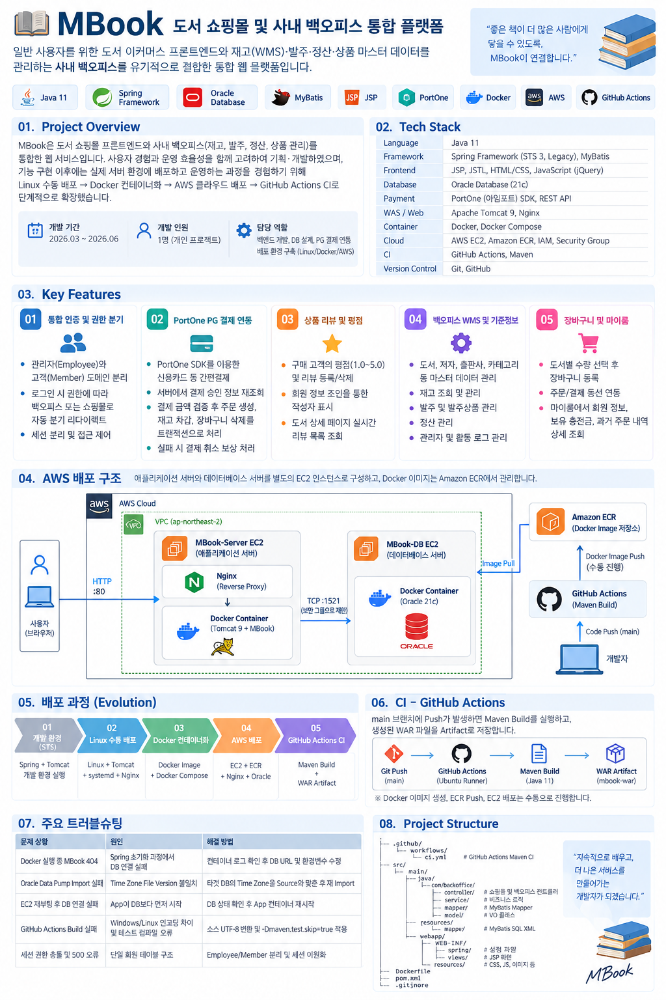

# 📚 MBook - 도서 쇼핑몰 및 사내 백오피스 통합 플랫폼

> **도서 쇼핑몰과 재고(WMS)·발주·정산·상품 기준정보를 관리하는 사내 백오피스를 하나의 서비스로 구현한 개인 프로젝트입니다.**

[](https://www.oracle.com/java/)
[](https://spring.io/)
[](https://www.oracle.com/)
[](https://mybatis.org/)
[](https://portone.io/)
[](https://www.docker.com/)
[](https://aws.amazon.com/)
[](https://github.com/features/actions)

---

## 📌 Project Overview

MBook은 일반 사용자가 도서를 조회하고 장바구니, 결제, 주문 내역, 리뷰 등의 기능을 이용할 수 있는 **도서 쇼핑몰**과  
상품·재고·발주·정산 등을 관리하는 **사내 백오피스**를 통합한 웹 애플리케이션입니다.

기능 구현 이후에는 개발 환경에서만 실행하는 데 그치지 않고  
**Linux 수동 배포 → Docker 컨테이너화 → AWS 배포 → GitHub Actions CI** 순서로 배포 환경을 확장했습니다.

- **개발 기간**: 2026.03 ~ 2026.06
- **개발 인원**: 1명 (개인 프로젝트)
- **담당 역할**: 백엔드 개발, 데이터베이스 설계 및 구축, PG 결제 연동, Linux/Docker/AWS 배포 환경 구축

---

## 🛠 Tech Stack

| 구분 | 기술 |
|---|---|
| Language | Java 11 |
| Backend | Spring Framework 5.3, MyBatis |
| Frontend | JSP, JSTL, HTML/CSS, JavaScript, jQuery |
| Database | Oracle Database |
| Payment | PortOne V1 REST API / JavaScript SDK |
| WAS / Web | Apache Tomcat 9, Nginx |
| Container | Docker, Docker Compose |
| Cloud | AWS EC2, Amazon ECR, IAM, Security Group |
| CI | GitHub Actions, Maven |
| Version Control | Git, GitHub |

---

## 🚀 Key Features

### 1️⃣ 통합 인증 및 권한 분기 시스템

- 사내 관리자용 `Employee`와 쇼핑몰 고객용 `Member` 도메인을 분리하여 설계
- 로그인 결과에 따라 백오피스와 쇼핑몰 접근 경로 분기
- 관리자 세션 `loginEmployee`와 사용자 세션 `loginUser`를 분리하여 권한별 접근 처리

```text
로그인 요청
    │
    ├─ Employee 인증 성공
    │       ↓
    │   BackOffice
    │
    └─ Member 인증 성공
            ↓
          Shop
```

---

### 2️⃣ PortOne PG 결제 연동 및 서버 검증

- PortOne을 이용한 카드 결제 프로세스 구현
- 클라이언트 결제 완료 후 `imp_uid`, `merchant_uid`를 Spring Server로 전달
- 서버에서 PortOne REST API를 통해 실제 결제정보 재조회
- 결제 상태, 주문번호, 결제금액을 서버의 장바구니 주문금액과 비교
- 검증 성공 후 주문 생성, 주문상품 생성, 재고 차감, 장바구니 삭제를 트랜잭션으로 처리
- 주문 처리 실패 시 승인된 결제를 취소하는 보상 처리 구현
- 주문번호 생성 시 Oracle Sequence를 사용하여 동시 주문 상황의 주문번호 충돌 방지

```text
결제 요청
   ↓
PortOne / PG
   ↓
결제 승인
   ↓
imp_uid / merchant_uid
   ↓
Spring Server
   ↓
PortOne REST API 결제정보 조회
   ↓
결제 상태 / 주문번호 / 금액 검증
   ↓
주문 생성
   ↓
주문상품 생성
   ↓
재고 차감
   ↓
장바구니 삭제
```

---

### 3️⃣ 상품 리뷰 및 평점 도메인

- 구매 고객이 도서별로 평점과 리뷰 등록 및 삭제 가능
- 리뷰 작성자와 회원정보를 조인하여 도서 상세 페이지에 작성자 정보 표시
- 도서별 리뷰 목록 및 평점 정보를 조회하여 상세 페이지에 제공

```text
Book
  │
  └─ BookReview
        │
        └─ Member
```

---

### 4️⃣ 사내 백오피스 WMS 및 기준정보 관리

- 도서, 저자, 출판사, 카테고리 등 상품 기준정보 CRUD 구현
- 도서와 저자 간 다대다 관계를 Mapping Table로 관리
- 도서별 재고 수량 조회 및 관리
- 발주 및 발주상품 관리
- 정산 정보 관리
- 관리자 및 활동 로그 관리

```text
BackOffice
   │
   ├─ Book
   ├─ Author
   ├─ Publisher
   ├─ Category
   ├─ Inventory
   ├─ Purchase Order
   ├─ Settlement
   ├─ Employee
   └─ Activity Log
```

---

### 5️⃣ 장바구니 및 주문 내역

- 도서 상세 페이지에서 수량을 선택하여 장바구니 등록
- 회원별 장바구니 데이터 관리
- 장바구니 상품을 기준으로 주문 및 결제 진행
- 주문 완료 후 주문정보와 주문상품 정보를 분리하여 저장
- 마이룸에서 회원정보 및 과거 주문내역 조회

```text
Book
  ↓
Cart
  ↓
Payment
  ↓
CustomerOrder
  ↓
OrderItem
```

---

# 🏗 Deployment & Infrastructure

기능 구현 이후 개발 PC에서만 실행하는 환경을 벗어나  
실제 서버 환경에서 애플리케이션이 실행되는 구조를 이해하기 위해 배포 환경을 단계적으로 확장했습니다.

```text
Linux 수동 배포
       ↓
Docker 컨테이너화
       ↓
AWS EC2 / ECR 배포
       ↓
GitHub Actions CI
```

---

## 1️⃣ Linux 수동 배포

VirtualBox Linux 환경에 Java 11, Tomcat 9, Nginx를 직접 설치하고  
Maven으로 생성한 WAR 파일을 Tomcat에 배포했습니다.

Tomcat을 `systemd` 서비스로 등록하여 시작, 종료, 재시작 및 서버 재부팅 후 자동 실행을 확인했습니다.

Nginx Reverse Proxy를 구성하여 클라이언트 요청을 Tomcat으로 전달하도록 구성했습니다.

```text
Client
  ↓
Nginx :80
  ↓
Tomcat :8080
  ↓
Spring MBook
  ↓
Oracle DB
```

Linux 사용자 및 그룹을 생성하고 배포 디렉터리에 대한 파일 권한을 설정했으며,  
SSH를 이용해 Windows 개발 PC에서 Linux Server로 접속하여 배포 작업을 수행했습니다.

이를 통해 IDE에서 애플리케이션을 실행하는 것과  
실제 서버에서 Web Server와 WAS를 구성하여 서비스하는 방식의 차이를 확인했습니다.

---

## 2️⃣ Docker 컨테이너화

Linux 서버에 Java와 Tomcat을 직접 설치하고 WAR 파일을 배포하던 방식에서  
**Tomcat과 MBook WAR를 하나의 Docker Image로 관리하는 방식**으로 변경했습니다.

### Dockerfile

```dockerfile
FROM tomcat:9.0-jdk11-temurin

COPY mbook.war /usr/local/tomcat/webapps/mbook.war
```

Docker Compose를 사용하여 다음 실행 설정을 관리했습니다.

- Docker Image Version
- Container Name
- Port Mapping
- Environment Variable
- Restart Policy

```text
Linux Server
     │
     ├─ Nginx
     │
     └─ Docker Compose
             │
             └─ MBook Container
                   │
                   ├─ Tomcat 9
                   └─ mbook.war
```

DB 접속정보와 PortOne API 인증정보는 Docker Image에 포함하지 않고  
별도의 환경변수 파일로 분리했습니다.

```text
Docker Image
    │
    ├─ Tomcat
    └─ MBook WAR


/etc/mbook/mbook.env
    │
    ├─ DB_URL
    ├─ DB_USERNAME
    ├─ DB_PASSWORD
    ├─ PORTONE_API_KEY
    └─ PORTONE_API_SECRET
```

또한 Docker Image를 `1.0`, `1.1`, `1.2`와 같이 버전별로 관리하고  
Docker Compose의 Image Version을 변경하여 이전 버전으로 롤백하는 과정을 직접 검증했습니다.

---

## 3️⃣ AWS 배포

VirtualBox에서 구성한 Docker 기반 환경을 AWS로 확장했습니다.

애플리케이션 서버와 데이터베이스 서버를 각각 별도의 EC2 인스턴스로 구성했으며,  
Docker Image는 Amazon ECR을 통해 저장하고 관리했습니다.

### AWS 최종 시스템 구성



```text
                       Internet
                           │
                        HTTP :80
                           │
                           ▼
                 ┌──────────────────┐
                 │ MBook-Server EC2 │
                 │                  │
                 │      Nginx       │
                 │        │         │
                 │        ▼         │
                 │ Docker Container │
                 │ Tomcat 9 + MBook │
                 └────────┬─────────┘
                          │
                       TCP 1521
                          │
                          ▼
                 ┌──────────────────┐
                 │   MBook-DB EC2   │
                 │                  │
                 │ Docker Container │
                 │    Oracle DB     │
                 └──────────────────┘
```

### MBook-Server EC2

- Nginx Reverse Proxy 구성
- Docker / Docker Compose 설치
- Amazon ECR에서 MBook Image Pull
- Tomcat 9 + MBook Container 실행
- Application Container를 `127.0.0.1:8081`에 바인딩
- 외부 사용자는 HTTP 80 포트의 Nginx를 통해 접근

```text
Internet
   ↓
EC2 :80
   ↓
Nginx
   ↓
127.0.0.1:8081
   ↓
Docker
   ↓
Tomcat 9
   ↓
MBook
```

### MBook-DB EC2

- Oracle Database를 Docker Container로 구성
- Application Server와 Database Server를 별도의 EC2로 분리
- Oracle 1521 포트는 Application Server에서만 접근 가능하도록 제한

```text
MBook-Server
     │
     │ TCP :1521
     ↓
MBook-DB
     │
     ↓
Oracle Container
```

### Amazon ECR

- MBook Docker Image 저장
- Docker Image Version 관리
- Application EC2에서 ECR Image Pull
- EC2 IAM Role을 이용하여 Access Key를 직접 저장하지 않고 ECR 접근

```text
Docker Image Build
       ↓
Amazon ECR
       ↓
Image Pull
       ↓
MBook-Server EC2
```

### Security Group

애플리케이션 서버와 데이터베이스 서버의 역할에 따라 Security Group을 분리했습니다.

```text
Internet
   │
   │ HTTP :80
   ▼
MBook-Server EC2
   │
   │ Oracle :1521
   ▼
MBook-DB EC2
```

- HTTP `80`: 외부 사용자 접근 허용
- Application `8081`: 외부에 직접 노출하지 않음
- Oracle `1521`: MBook-Server Security Group에서만 접근 허용
- SSH `22`: 관리자 IP에서만 접근
- DB 및 PortOne 인증정보는 환경변수 파일로 분리

---

## 4️⃣ Oracle DB 이전

기존 Windows 환경에서 사용하던 Oracle DB를 AWS의 별도 Database EC2로 이전했습니다.

Oracle Data Pump를 이용해 기존 데이터를 Export한 뒤  
AWS에서 실행 중인 Oracle Docker Container로 Import했습니다.

```text
Windows Oracle
      │
    expdp
      ↓
   mbook.dmp
      │
    impdp
      ↓
MBook-DB EC2
      │
      ↓
Oracle Docker Container
```

DB 이전 후 기존 테이블과 데이터 건수를 비교하여 정상 이전 여부를 확인했으며,  
MBook 애플리케이션에서 다음 기능을 통해 실제 DB 연결을 검증했습니다.

```text
상품 조회
로그인
장바구니 등록
장바구니 조회
장바구니 삭제
주문 관련 DB 처리
```

---

# 🔄 CI - GitHub Actions

기존에는 소스 코드를 수정한 후 STS에서 직접 Maven Build를 실행해 WAR 파일을 생성했습니다.

이를 개선하기 위해 `main` 브랜치에 Push가 발생하면  
GitHub Actions의 Ubuntu Runner에서 자동으로 Maven Build를 수행하도록 구성했습니다.

```text
Code 수정
   ↓
Git Push
   ↓
GitHub Actions
   ↓
Java 11
   ↓
Maven Build
   ↓
WAR 생성
   ↓
mbook-war Artifact
```

GitHub Actions에서 생성된 WAR 파일은 `mbook-war` Artifact로 저장됩니다.

### CI Workflow

```yaml
name: MBook CI

on:
  push:
    branches:
      - main

jobs:
  build:
    runs-on: ubuntu-latest

    steps:
      - name: Checkout source
        uses: actions/checkout@v4

      - name: Set up Java 11
        uses: actions/setup-java@v4
        with:
          distribution: temurin
          java-version: '11'

      - name: Build with Maven
        run: mvn clean package -Dmaven.test.skip=true

      - name: Upload WAR artifact
        uses: actions/upload-artifact@v4
        with:
          name: mbook-war
          path: target/*.war
```

### 자동화 범위

현재 자동화 범위는 **CI까지**이며 Docker Image 생성 이후 AWS 배포 과정은 수동으로 진행합니다.

```text
[CI 자동화]

Git Push
   ↓
Maven Build
   ↓
WAR 생성
   ↓
Artifact 저장


[수동 배포]

WAR 다운로드
   ↓
Docker Image Build
   ↓
Amazon ECR Push
   ↓
EC2 Image Pull
   ↓
Docker Compose 배포
```

Docker Image 생성, ECR Push, EC2 배포를 수동으로 유지하면서  
각 배포 단계와 Image Version 관리 및 Rollback 과정을 직접 수행했습니다.

---

# 💡 Troubleshooting & Problem Solving

## 1️⃣ Docker Container는 실행 중이지만 MBook 404 발생

### 문제

Docker Container가 `Up` 상태임에도 MBook 접근 시 HTTP 404가 발생했습니다.

### 원인

Container 자체는 실행 중이었지만 Spring Context 초기화 과정에서  
Oracle DB 연결에 실패하여 애플리케이션이 정상적으로 올라오지 않은 상태였습니다.

### 해결

Docker Container Log를 확인하여 Spring의 DB 연결 오류를 찾고  
Oracle DB URL과 환경변수를 수정했습니다.

```text
Docker Container
      │
      │ Up
      ▼
Tomcat 실행
      │
      ▼
Spring Context 초기화
      │
      X
Oracle DB 연결 실패
```

### 결과

Container 상태뿐 아니라 Application Log와 HTTP 응답까지 확인해야  
실제 애플리케이션 정상 여부를 판단할 수 있다는 점을 확인했습니다.

---

## 2️⃣ Oracle Data Pump Import 실패

### 문제

Windows Oracle에서 Export한 데이터를 AWS Oracle로 Import하는 과정에서  
Data Pump Import가 실패했습니다.

### 원인

Source Oracle과 Target Oracle의 `Time Zone File Version`이 서로 달랐습니다.

```text
Source Oracle
Time Zone Version 45

        ≠

Target Oracle
Time Zone Version 43
```

### 해결

Target Oracle의 Time Zone Version을 Source와 동일하게 맞춘 후  
Data Pump Import를 다시 수행했습니다.

### 결과

기존 Oracle의 테이블과 데이터를 AWS Oracle 환경으로 정상 이전했습니다.

---

## 3️⃣ EC2 재부팅 후 DB 연결 실패

### 문제

AWS EC2를 재시작한 후 MBook Container는 실행 중이었지만  
애플리케이션에서 DB 연결 오류가 발생했습니다.

### 원인

Application Container가 시작되는 시점에  
Oracle Database Service가 아직 준비되지 않은 상태였습니다.

```text
EC2 Start

 ├─ MBook Container 시작
 │       ↓
 │   DB 연결 요청
 │       ↓
 │      실패
 │
 └─ Oracle Container 시작
          ↓
       Oracle Ready
```

### 해결

Oracle Database Log에서 `DATABASE IS READY TO USE!` 상태를 확인한 뒤  
Application Container를 재시작했습니다.

### 결과

Docker의 `restart: unless-stopped` 설정은 Container 프로세스 재시작은 처리하지만  
외부 의존 서비스의 Ready 상태까지 보장하지 않는다는 점을 확인했습니다.

---

## 4️⃣ GitHub Actions Maven Build 실패

### 문제

Windows 개발 환경에서는 정상적으로 Build되던 프로젝트가  
GitHub Actions Ubuntu Runner에서는 Maven Build에 실패했습니다.

### 원인

일부 Java 소스가 Windows 계열 문자 인코딩으로 저장되어 있어  
Linux UTF-8 환경에서 컴파일 오류가 발생했습니다.

또한 처음 적용한 다음 옵션은 테스트 실행만 제외할 뿐 Test Compile은 계속 수행했습니다.

```bash
mvn clean package -DskipTests
```

### 해결

Java Source Encoding을 UTF-8 기준으로 정리하고  
WAR 생성 목적의 CI에서는 테스트 실행과 테스트 컴파일을 모두 제외하도록 변경했습니다.

```bash
mvn clean package -Dmaven.test.skip=true
```

### 결과

GitHub Actions에서 Maven Build가 정상적으로 완료되고  
`mbook-war` Artifact가 생성되는 것을 확인했습니다.

---

## 5️⃣ 세션 권한 충돌 및 예외 처리

### 문제

초기 인증 구조에서 관리자와 일반 회원을 함께 처리하는 과정에서  
세션 권한 충돌 및 상세 페이지 접근 시 예외가 발생했습니다.

### 해결

관리자 `Employee`와 고객 `Member` 도메인을 분리하고  
각각 별도의 로그인 세션을 사용하도록 인증 구조를 수정했습니다.

```text
관리자
Employee
   ↓
loginEmployee


일반 사용자
Member
   ↓
loginUser
```

### 결과

사용자 유형별 세션과 접근 권한을 명확하게 분리하여  
쇼핑몰과 백오피스의 인증 구조를 독립적으로 관리할 수 있도록 개선했습니다.

---

# 📂 Project Structure

```text
.
├── .github/
│   └── workflows/
│       └── ci.yml                 # GitHub Actions Maven CI
│
├── src/
│   └── main/
│       ├── java/
│       │   └── com/backoffice/
│       │       ├── controller/    # 쇼핑몰 / 백오피스 Controller
│       │       ├── service/       # Business Logic
│       │       ├── mapper/        # MyBatis Mapper Interface
│       │       └── model/         # VO / Domain
│       │
│       ├── resources/
│       │   └── mapper/            # MyBatis SQL XML
│       │
│       └── webapp/
│           ├── WEB-INF/
│           │   ├── spring/        # Spring 설정
│           │   └── views/         # JSP View
│           │
│           └── resources/         # CSS / JS / Image
│
├── Dockerfile
├── pom.xml
└── .gitignore
```

---

# 📈 Deployment Evolution

이번 프로젝트에서는 처음부터 Docker와 AWS를 사용하는 대신  
배포 환경을 단계적으로 확장했습니다.

```text
① Spring + Tomcat

개발 환경에서
애플리케이션 실행

        ↓

② Linux + Tomcat + systemd + Nginx

Linux 서버에 WAR 수동 배포
Tomcat 서비스 관리
Nginx Reverse Proxy 구성

        ↓

③ Linux + Docker + Docker Compose + Nginx

Tomcat + WAR 컨테이너화
환경변수 외부 분리
Docker Compose 관리
Image Version / Rollback

        ↓

④ AWS EC2 + ECR + Docker + Nginx + Oracle

Application / DB EC2 분리
ECR Docker Image 관리
Security Group 네트워크 제한
IAM Role 적용
Oracle DB 이전

        ↓

⑤ GitHub Actions + Maven

main Branch Push
Maven Build
WAR Artifact 자동 생성
```

Linux 수동 배포부터 Docker 컨테이너화, AWS EC2 환경 구축, DB 서버 분리,  
Amazon ECR Image 관리, GitHub Actions 기반 Maven Build 자동화까지 단계적으로 확장했습니다.

각 단계를 직접 구성하면서 Linux 서비스 관리, Reverse Proxy, Docker Container,  
AWS 네트워크 및 IAM 권한, 애플리케이션과 DB 간 연결, CI Build가  
실제 배포 과정에서 어떻게 연결되는지 확인했습니다.

---

# ✅ Final Architecture

```text
                      Developer
                          │
                     Git Push
                          │
                          ▼
                       GitHub
                          │
                          ▼
                  GitHub Actions
                          │
                    Maven Build
                          │
                    WAR Artifact
                          │
                    [수동 배포]
                          │
                          ▼
                   Docker Image
                          │
                      ECR Push
                          │
                          ▼
                    Amazon ECR
                          │
                      Image Pull
                          │
                          ▼
                ┌───────────────────┐
                │ MBook-Server EC2  │
Internet        │                   │
   │            │      Nginx        │
   │ HTTP :80   │        │          │
   └───────────▶│        ▼          │
                │ 127.0.0.1:8081   │
                │        │          │
                │        ▼          │
                │ Docker Container  │
                │ Tomcat 9 + MBook  │
                └─────────┬─────────┘
                          │
                       TCP 1521
                          │
                          ▼
                ┌───────────────────┐
                │   MBook-DB EC2    │
                │                   │
                │ Docker Container  │
                │    Oracle DB      │
                └───────────────────┘
```

---

# 📌 Summary

MBook은 도서 쇼핑몰과 사내 백오피스를 하나의 웹 애플리케이션으로 구현한 개인 프로젝트입니다.

Spring Framework와 MyBatis를 이용한 웹 서비스 개발뿐만 아니라  
PortOne PG 결제 및 서버 검증, Oracle DB 설계, Linux 서버 배포, Docker 컨테이너화,  
AWS EC2/ECR 환경 구축, Oracle DB 이전, GitHub Actions CI까지 직접 구성했습니다.

개발 환경에서 정상적으로 동작하는 애플리케이션을 실제 서버 환경으로 옮기는 과정에서  
DB 연결, Container 상태, Network 접근, Oracle Data Migration, CI Build 등 다양한 문제를 직접 확인하고 해결했습니다.

이를 통해 애플리케이션 개발뿐만 아니라  
**애플리케이션이 빌드되고, 서버에 배포되고, 네트워크와 데이터베이스를 통해 실제 서비스로 동작하는 전체 흐름**을 경험했습니다.
